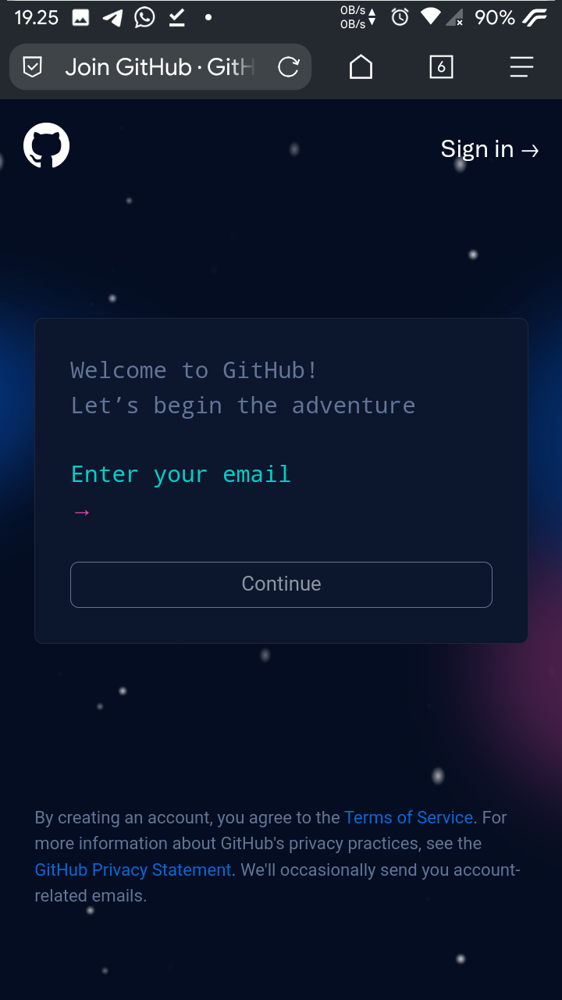
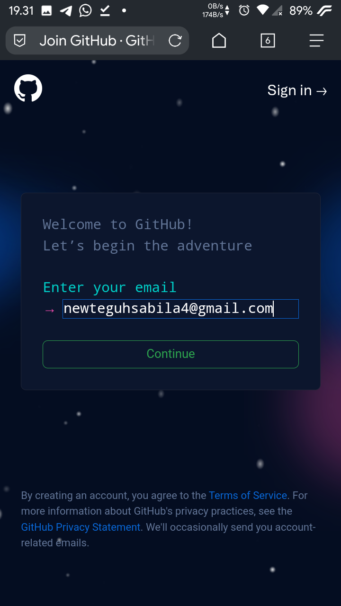
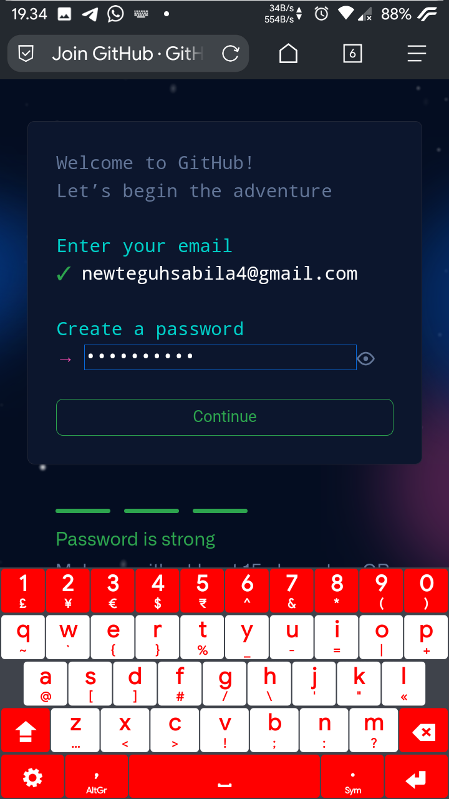
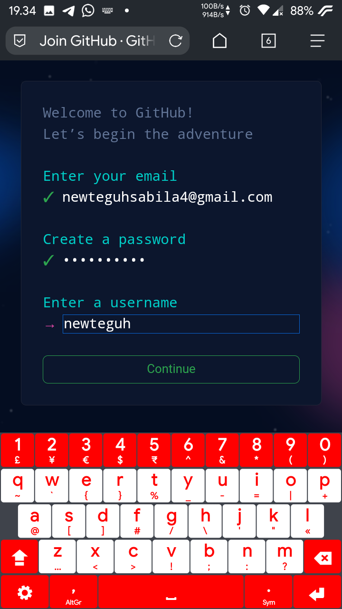
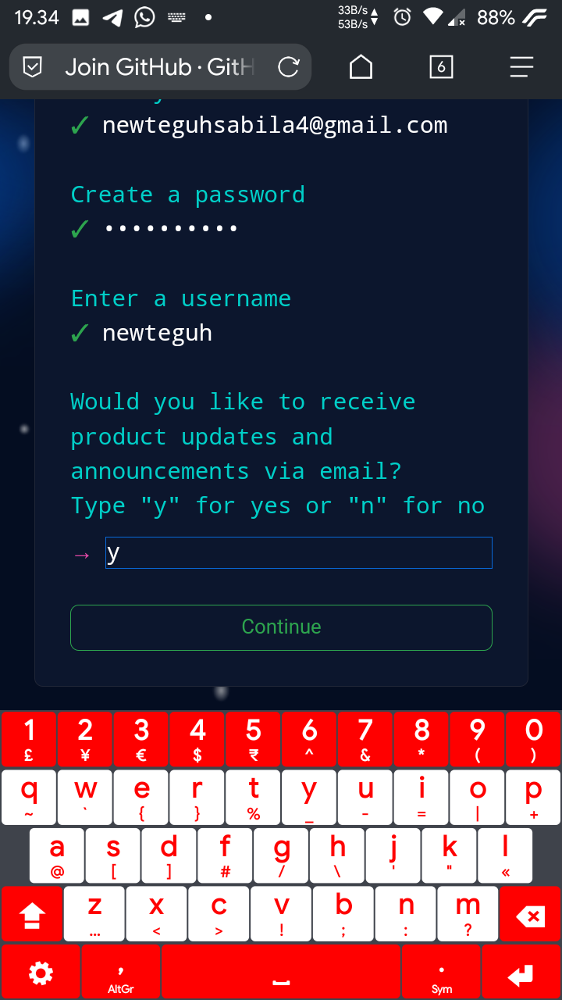
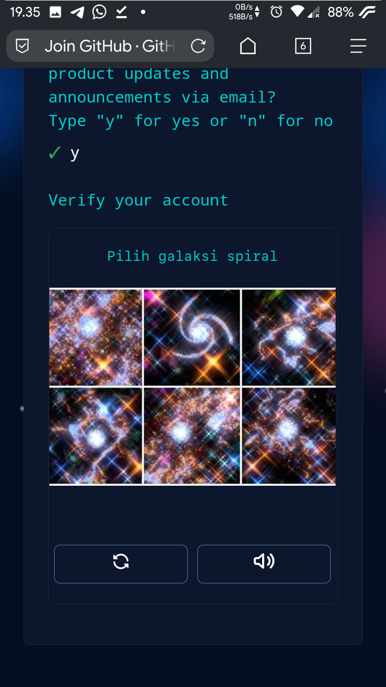
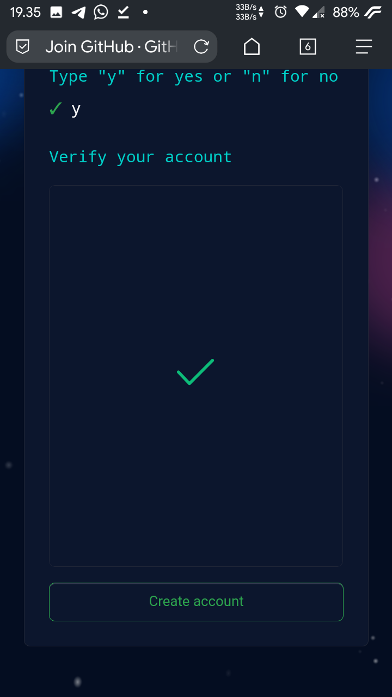
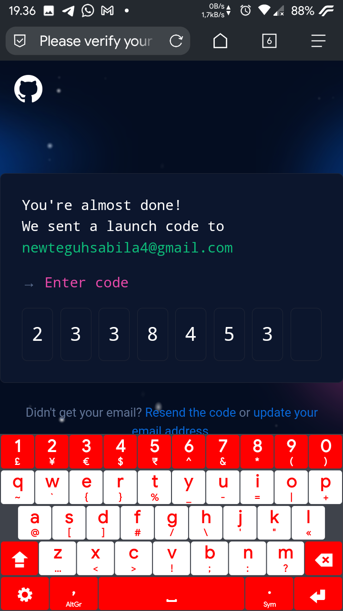
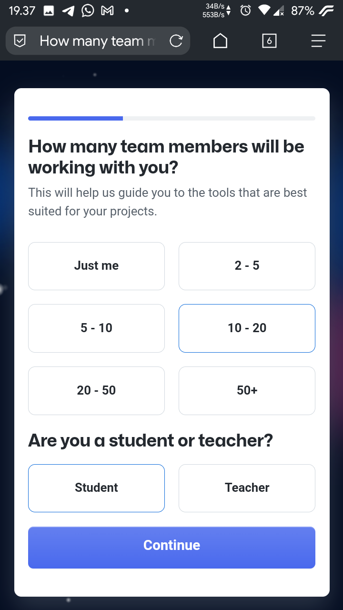

# Membuat Akun Github di Android

## Apa itu github 
GitHub adalah layanan hos web bersama untuk membuat sebuah projek program atau perangkat lunak yang menggunakan sistem kendali versi [Git](https://id.m.wikipedia.org/wiki/Git) dan layanan hosting internet. GitHub merupakan salah satu platform wajib bagi developer atau programmer karena menawarkan kemudahan untuk mengelola kode pada project. Platform ini cukup populer dengan lebih dari 56 juta pengguna.

## Langkah-langkah membuat akun github di Android

-  Pertama buka website github  atau kamu dapat membukan link berikut ini [https://github.com/signup](https://github.com/signup), dan kamu akan melihat tampilan seperti ini

   
- Isi dengan email kamu yang akan di daftarkan untuk membuat akun github lalu klik continue
  
  
- Selanjutnya buat password untuk akun github bebas asal jangan sampe lupa :v
   
   
- Lalu buat username github kamu sebagai identitas kamu, untuk pelatihan code on phone saya wajibkan username menggunakan nama asli kamu lalu continue
   
   
- Setelah itu kamu ketik y aja, itu kamu di suruh untuk mensetujui info update terbaru dari github lalu continue

   
- Selanjutnya kamu disuruh verifikasi akun klik verifikasi lalu kamu akan di suruh memilih gambar sesuai perintah di atas nya, misalnya di suruh pilih gambar galaksi spiral maka pilih yang gambar galaksi spiral, kalo ga tau galaksi spiral nora deh. intinya gambarnya kayak suriken.
   
   
- Setelah beres verifikasi klik create account

   
- Lalu kamu akan di suruh masukan kode verifikasi, masukan kode yang dikirim melalui email yang kamu daftarkan tadi cek aplikasi gmail nyaa!! lalu ketik pada blok berikut
   
   
- Selanjutnya kamu akan disuruh memilih jumlah member anggota yang bekerja sama dengan kamu, sebenarnya bisa di isi bebas, pilih aja yang 10-20. Untuk posisi kamu pilih student aja yaa karena kamu bukan seorang guru :)
   
   
- Lalu kamu akan di suruh pilih tools apa saja yang akan kamu gunakan untuk membangun projek kamu, kamu centang aja semuanya supaya kamu bisa menggunakan semua fitur nya nanti jika akan dibutuhkan, lalu klik continue
   
   
- Github menyediakan fitur berbayar untuk beberapa fitur, namun karena kita gunakan platform ini hanya untuk belajar jadi kita pake yang gratisan aja yaa guys, github juga menyediakan fitur gratis ko untuk pelajar :)

   
- Tadaa!! kamu berhasil membuat akun github, setelah itu kami bisa mulai membuat projek mandiri ataupun bergabung bersama tim untuk membuat projek bersama, sabar yaa materi nya akan di lanjut nanti. cukup sampe sini dulu.
   
   

Selamat belajar :)
